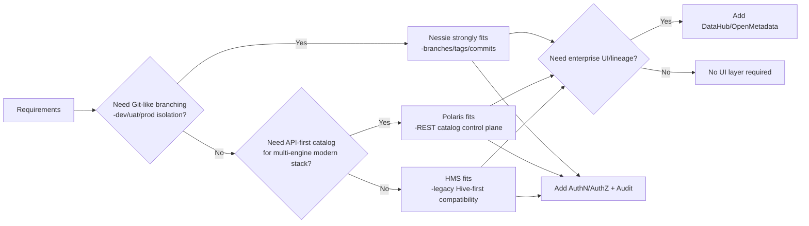

```mermaid
flowchart LR
  %% Decision helper: catalog selection by requirement
  RQ[Requirements] --> D1{Need Git-like branching\n-dev/uat/prod isolation?}
  D1 -- Yes --> N1[Nessie strongly fits\n-branches/tags/commits]
  D1 -- No --> D2{Need API-first catalog\nfor multi-engine modern stack?}
  D2 -- Yes --> P1[Polaris fits\n-REST catalog control plane]
  D2 -- No --> H1[HMS fits\n-legacy Hive-first compatibility]

  %% Co-existence
  N1 --> D3{Need enterprise UI/lineage?}
  P1 --> D3
  H1 --> D3
  D3 -- Yes --> U1[Add DataHub/OpenMetadata]
  D3 -- No --> U0[No UI layer required]

  %% Governance is separate in most cases
  N1 --> G1[Add AuthN/AuthZ + Audit]
  P1 --> G1
  H1 --> G1

```
