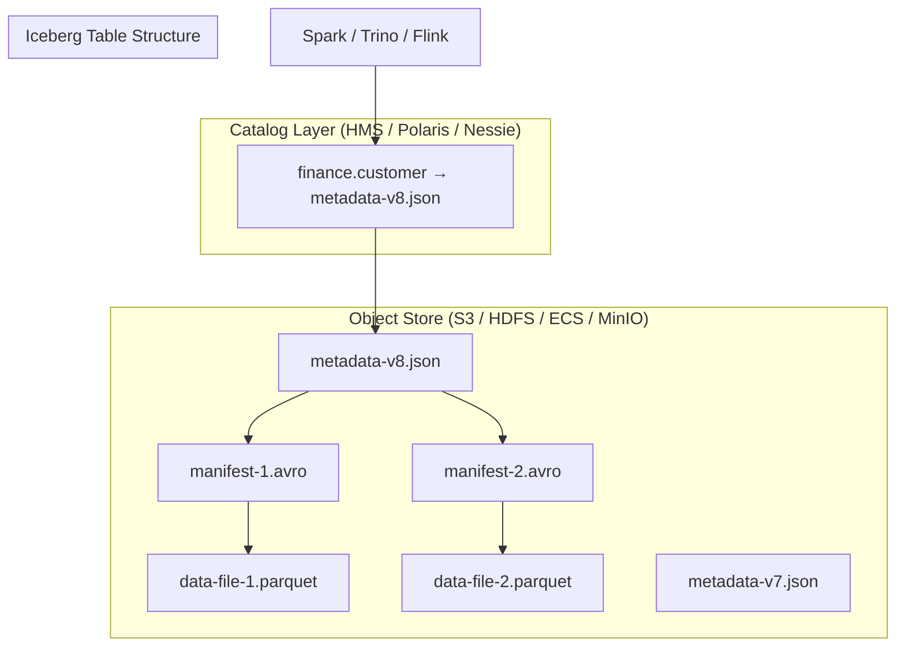

```mermaid
flowchart TB

  subgraph OBJECT_STORE["Object Store (S3 / HDFS / ECS / MinIO)"]
    DATA1[data-file-1.parquet]
    DATA2[data-file-2.parquet]
    MAN1[manifest-1.avro]
    MAN2[manifest-2.avro]
    META7[metadata-v7.json]
    META8[metadata-v8.json]
  end

  subgraph ICEBERG_TABLE["Iceberg Table Structure"]
    META8 --> MAN1
    META8 --> MAN2
    MAN1 --> DATA1
    MAN2 --> DATA2
  end

  subgraph CATALOG_LAYER["Catalog Layer (HMS / Polaris / Nessie)"]
    POINTER["finance.customer → metadata-v8.json"]
  end

  ENGINE[Spark / Trino / Flink]

  ENGINE --> POINTER
  POINTER --> META8

```
