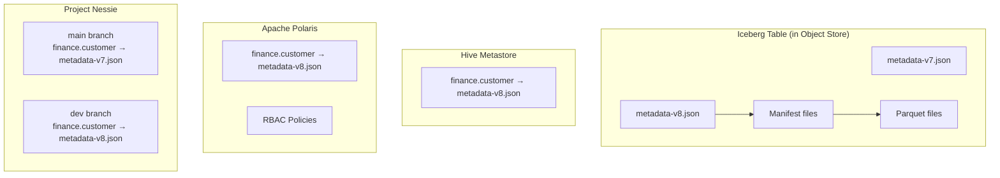

```mermaid
flowchart TB

  subgraph ICEBERG["Iceberg Table (in Object Store)"]
    M1[metadata-v7.json]
    M2[metadata-v8.json]
    MAN[Manifest files]
    DATA[Parquet files]
    M2 --> MAN
    MAN --> DATA
  end

  subgraph HMS["Hive Metastore"]
    H1["finance.customer → metadata-v8.json"]
  end

  subgraph POLARIS["Apache Polaris"]
    P1["finance.customer → metadata-v8.json"]
    P2["RBAC Policies"]
  end

  subgraph NESSIE["Project Nessie"]
    N1["main branch\nfinance.customer → metadata-v7.json"]
    N2["dev branch\nfinance.customer → metadata-v8.json"]
  end

```
