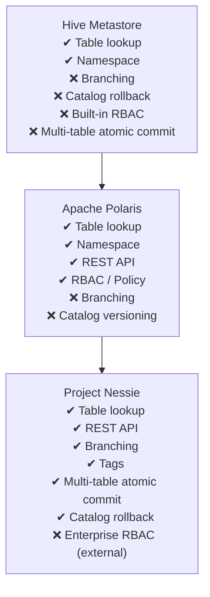

```mermaid
flowchart TB

  HMS_BOX["Hive Metastore
  ✔ Table lookup
  ✔ Namespace
  ❌ Branching
  ❌ Catalog rollback
  ❌ Built-in RBAC
  ❌ Multi-table atomic commit"]

  POLARIS_BOX["Apache Polaris
  ✔ Table lookup
  ✔ Namespace
  ✔ REST API
  ✔ RBAC / Policy
  ❌ Branching
  ❌ Catalog versioning"]

  NESSIE_BOX["Project Nessie
  ✔ Table lookup
  ✔ REST API
  ✔ Branching
  ✔ Tags
  ✔ Multi-table atomic commit
  ✔ Catalog rollback
  ❌ Enterprise RBAC (external)"]

  HMS_BOX --> POLARIS_BOX
  POLARIS_BOX --> NESSIE_BOX

```
