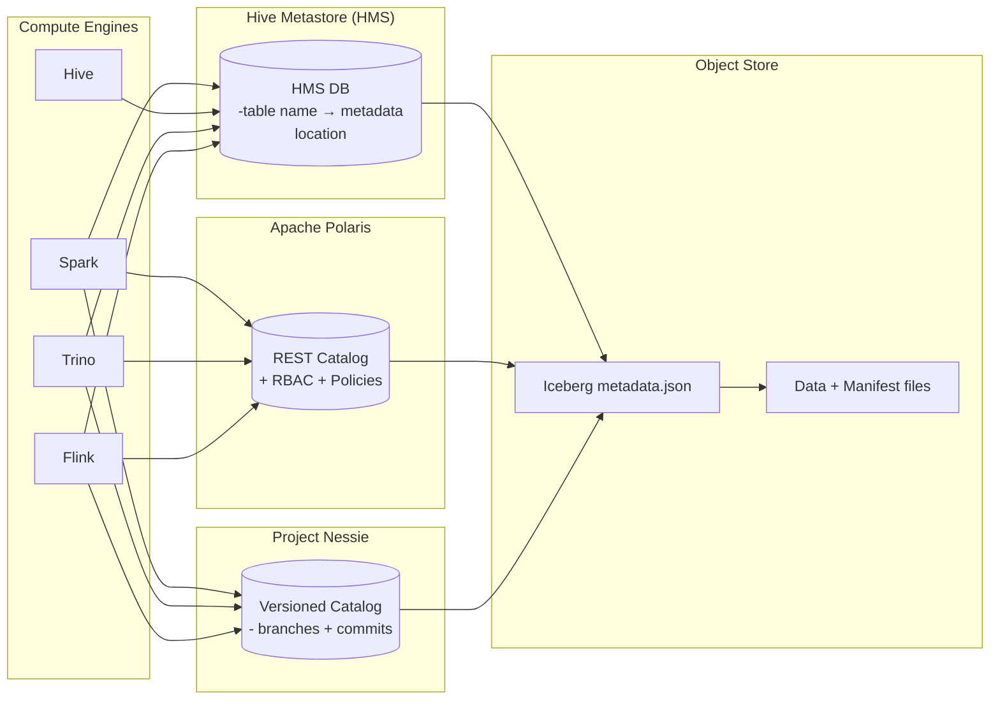

```mermaid
flowchart LR

  subgraph ENGINES["Compute Engines"]
    SPARK[Spark]
    HIVE[Hive]
    TRINO[Trino]
    FLINK[Flink]
  end

  subgraph HMS_LAYER["Hive Metastore (HMS)"]
    HMS[(HMS DB\n -table name → metadata location)]
  end

  subgraph POLARIS_LAYER["Apache Polaris"]
    POLARIS[(REST Catalog\n+ RBAC + Policies)]
  end

  subgraph NESSIE_LAYER["Project Nessie"]
    NESSIE[(Versioned Catalog\n- branches + commits)]
  end

  subgraph STORAGE["Object Store"]
    META[Iceberg metadata.json]
    DATA[Data + Manifest files]
  end

  %% HMS connections
  SPARK --> HMS
  HIVE --> HMS
  TRINO --> HMS
  FLINK --> HMS
  HMS --> META

  %% Polaris connections
  SPARK --> POLARIS
  TRINO --> POLARIS
  FLINK --> POLARIS
  POLARIS --> META

  %% Nessie connections
  SPARK --> NESSIE
  TRINO --> NESSIE
  FLINK --> NESSIE
  NESSIE --> META

  META --> DATA

```
